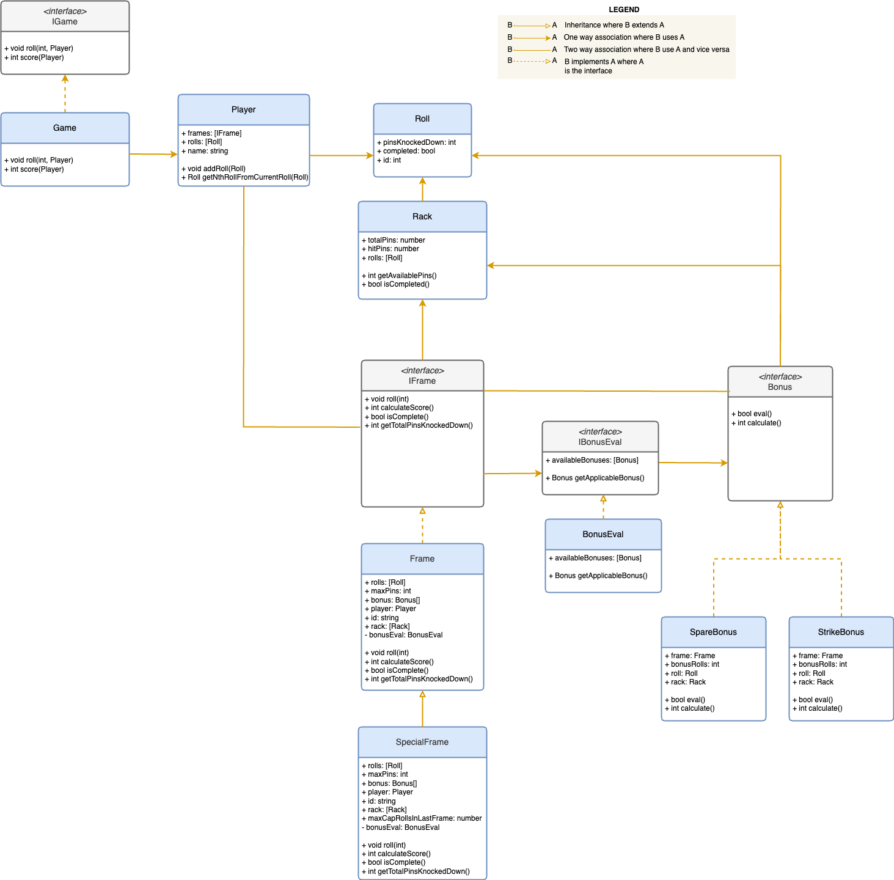

# Bowling Kata Typescript
https://kata-log.rocks/bowling-game-kata

# Game Play 
To understand the game play and run various scenarios please refer and run the tests under **<root>/integration_tests/GamePlay.test.ts**

# UML Class Design


# Run Tests with Coverage
```
npm install
npm test
```
>Note: Integration tests are located in the <root>/integration_tests folder. Unit tests are located in the __tests__ folders under their respective directories within the src folder. **The test coverage reports can be found under <root>/coverage folder.**

**Generated coverage report:**


